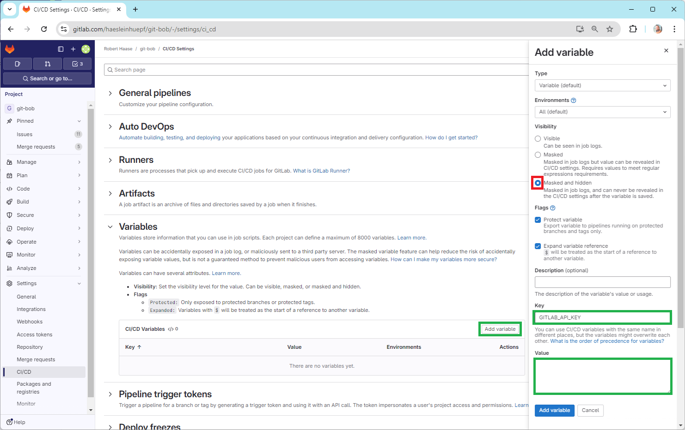
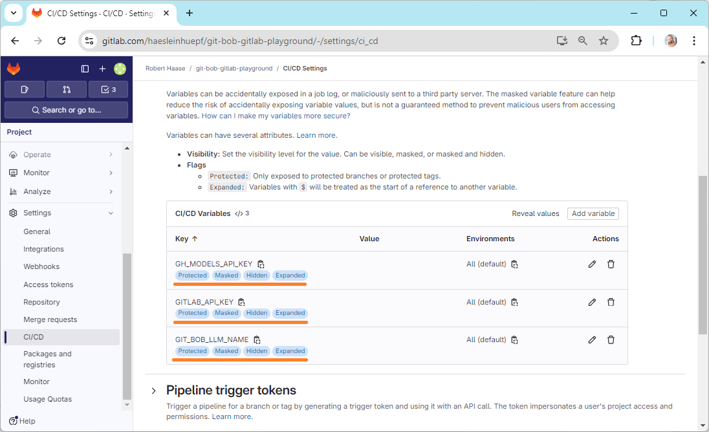
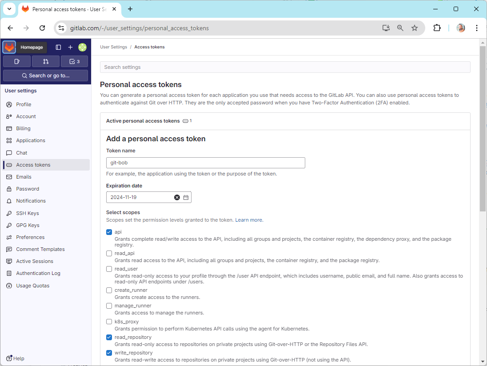
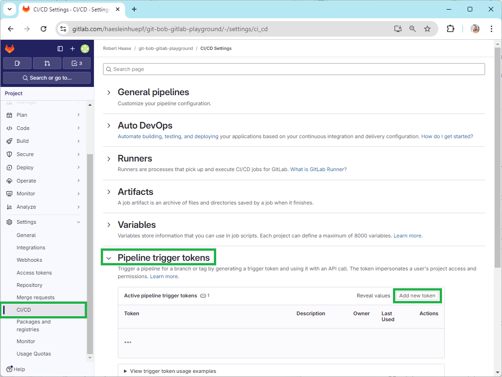
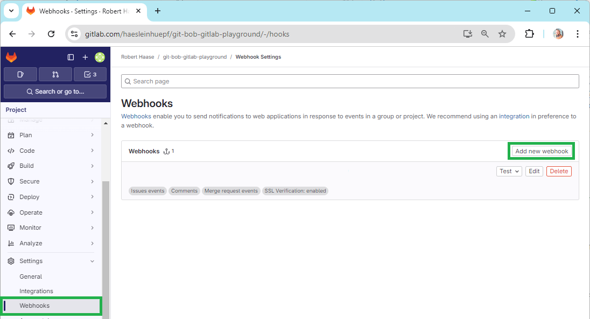
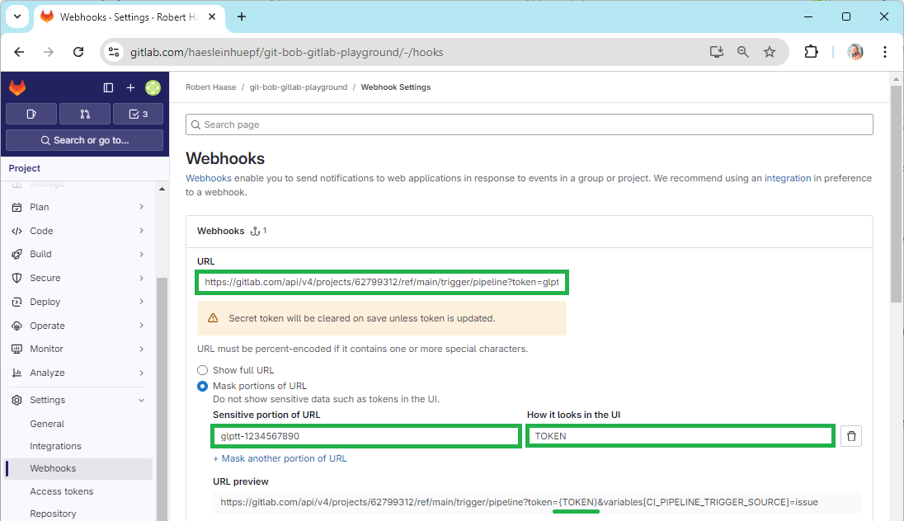
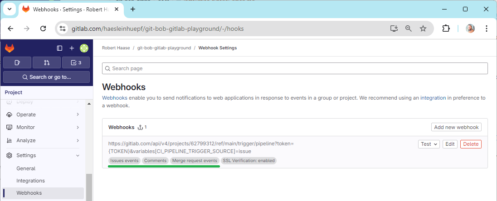
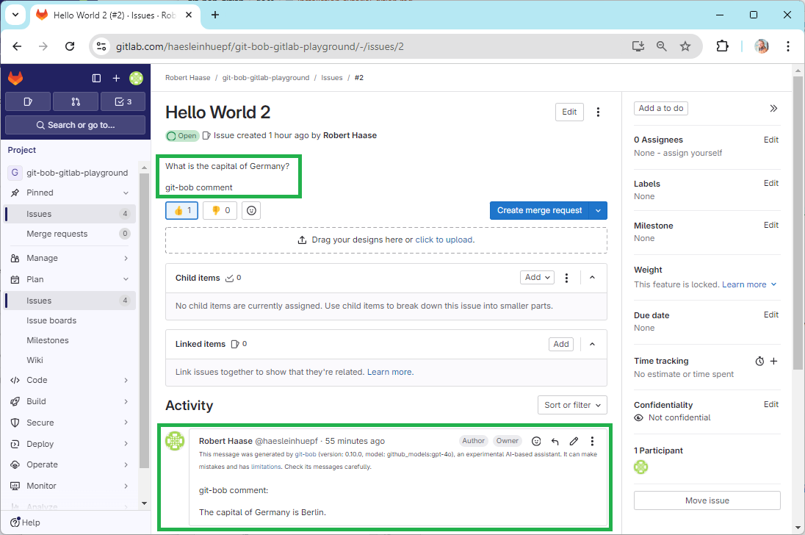

# Installation in git-lab

Since version 0.10.1 git-bob has experimental support for [gitlab](https://gitlab.com).
Feedback about the instructions provided here are very [welcome](https://github.com/haesleinhuepf/git-bob/issues/new)!

For demonstration purposes, a [playground repository on gitlab.com](https://gitlab.com/haesleinhuepf/git-bob-gitlab-playground) has been set up as demonstrated in the following.

## Create a new repository

* Create a new repository in your gitlab instance or on [https://gitlab.com](https://gitlab.com). 
* Add the [.gitlab-ci.yml](../.gitlab/.gitlab-ci.yml) to the root folder of your repository. 
  In this file, make the following modifications:
  * If you are working with an own gitlab instance, modify the variable `GIT_SERVER_URL`. Enter the url of your server and finish with "/".
  * In the line `- pip install git-bob==0.10.1` consider updating the version number.
* Add a requirements.txt (or remove the line `- pip install -r requirements.txt`) from the yml file.

## Setting access tokens

In the gitlab web interface, go to project settings > CI / CD > Variables. 
Add new variables named `GIT_BOB_LLM_NAME`, `OPENAI_API_KEY`, `GH_MODELS_API_KEY`, `ANTHROPIC_API_KEY`, `GOOGLE_API_KEY` (depending on which LLM service provide you wish to use).



IMPORTANT: There seems a bug currently in the interface. After adding one variable, reload the page and click on "Add variable again".
Ensure that all created variables have the settings `Protected`, `Masked`, `Hidden` as shown here:



Also configure a variable named `GITLAB_API_KEY`. You can retrieve this key from User > Preferences > Access Tokens.


When creating this key, make sure to select "api", "read repository" and "write repository":



This API key needs to be added as variable `GITLAB_API_KEY` as explained above. 
DO NOT share this key with anyone and DO NOT save it in any file that is visible on the internet.

## Pipeline triggering

Next, we need to configure that new issues trigger git-bob. 
You can also read more about how to do this in the [git lab documentation](https://docs.gitlab.com/ee/ci/triggers/).

Go to Project settings > CI / CD > Pipeline Trigger Tokens and create a token. 
Copy the token, you will need it in the next step.



## Web hooks

Go to Project settings > Webhooks and create a new webhook.



As URL specify the following. Replace PROJECT_ID by your project's ID (a long number) and the TOKEN by the pipeline token you received above.
```
https://gitlab.com/api/v4/projects/PROJECT_ID/ref/main/trigger/pipeline?token=TOKEN&variables[CI_PIPELINE_TRIGGER_SOURCE]=issue
```

Then, configure masks to hide the token again, e.g. like this:



Also make sure to configure triggers: Comments, Issue events, Merge request events


In the list of web hooks it should then look like this:



## Testing the installation

Go to your repository and create a new issue ([example](https://gitlab.com/haesleinhuepf/git-bob-gitlab-playground/-/issues/2)). E.g. write a request like this and use a trigger word for git-bob:
```
What is the capital of Germany?

git-bob comment
```

If everything is configured correctly, git-bob will respond in your name, because it uses your Gitlab API key:


