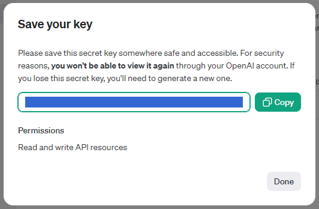
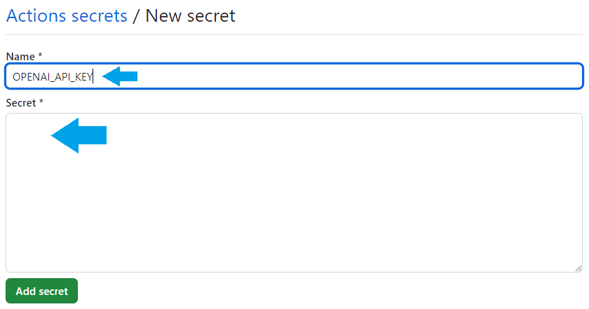
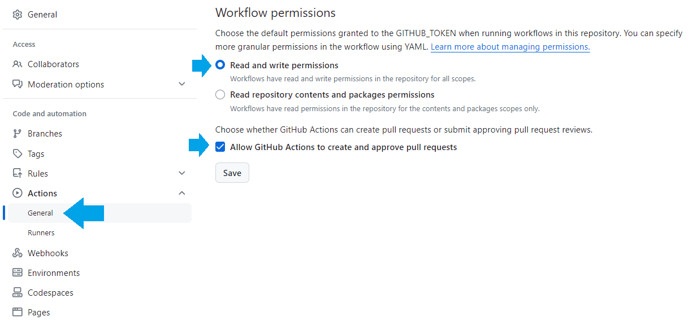
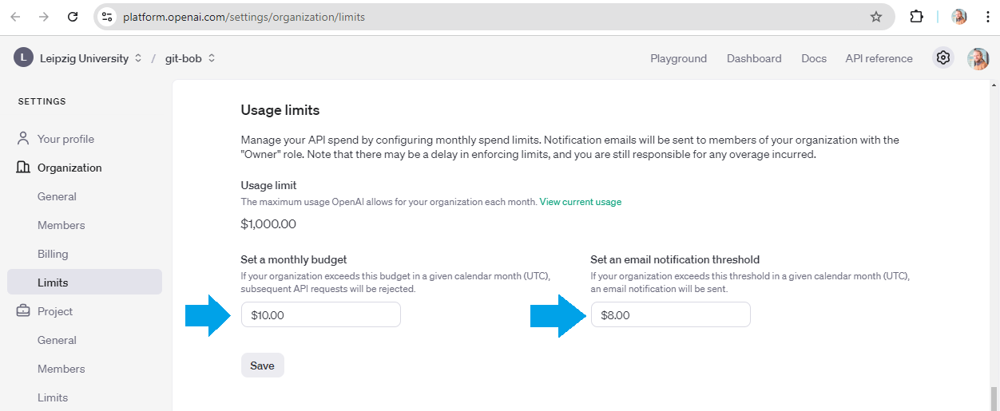
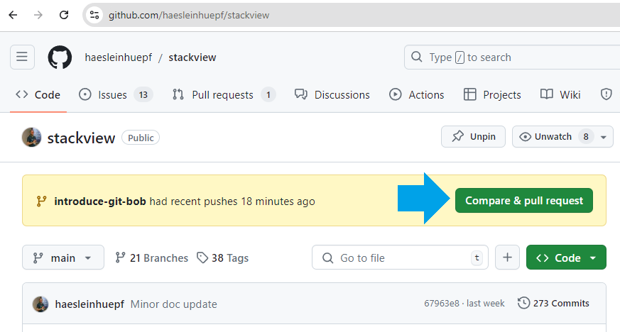
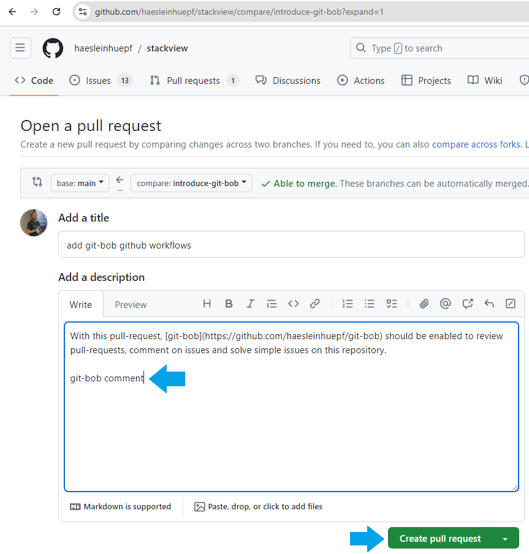
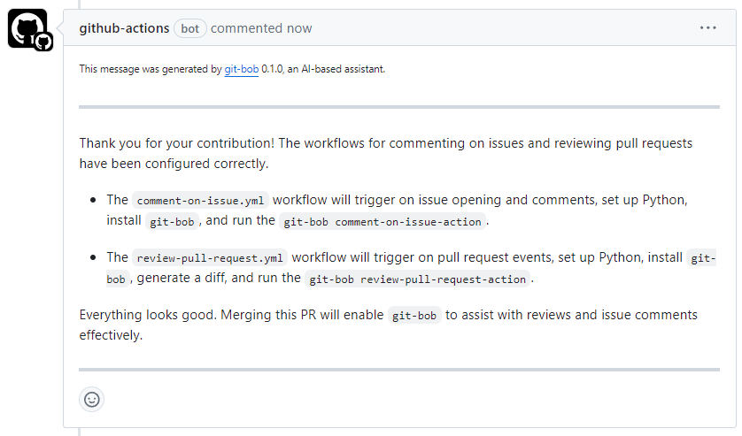

# git-bob Installation Tutorial

In this tutorial, we will install `git-bob` in the `stackview` repository to demonstrate all steps necessary for this.
Afterwards, `git-bob` can use AI to help developing `stackview`.

## Step 1: github workflows.

The first step is to copy over the github workflows from the `git-bob` repository to the `stackview` repository.
It is recommended to do this change on a git-branch. We can then test this, before we submit the changes.
We only adapt one thing, we replace this line:

```
pip install -e .
```

by this one:

```
pip install git-bob==0.1.0
```

You can see the full [git commit here](https://github.com/haesleinhuepf/stackview/commit/a5542352b2f2dd7e2cfbff32280ae8cec0015458).

## Step 2: Creating an OpenAI API Key

We navigate to the [openai API website](https://openai.com/index/openai-api/) and log in.

You find the [API Key page](https://platform.openai.com/api-keys) by clicking on `Dashbord` and `API Keys`.


Click on `Create new secret key` and enter a meaningful name.


Copy the key from this text field:



And navigate to the repository on github 

```
https://github.com/<GITHUB ORGANIZATION>/<REPOSITORY>/settings/secrets/actions
```

In our case, we navigate to `stackview`:
```
https://github.com/haesleinhuepf/stackview/settings/secrets/actions
```

Click on `New repository secret` 


Enter the key name `OPENAI_API_KEY` and paste the key into the value field.



In the menu on the right, under Actions / General, give read and write permissions to the Workflows using the `GITHUB_TOKEN` and allow github actions to create and merge pull-requests.



## Step 3 (optional):

Go back to the OpenAI API website and set a limit for the API key. With this you can make sure that the usage does not spend to much money:




## Step 4: Testing the installation

Next, we navigate to the github repository and submit our changes as pull-request.



In this pull-request, enter `git-bob comment` and it will review the pull-request in the new repository:



Wait a second and this box should appear indicating that the git-bob github action is running:


If the installation works, another box will appear after a minute with a review from git-bob:



After merging this pull-request, you can continue asking `git-bob comment` in all pull-requests and issues in the repository.

In case of any issues while installing, please mention `@haesleinhuepf`.
