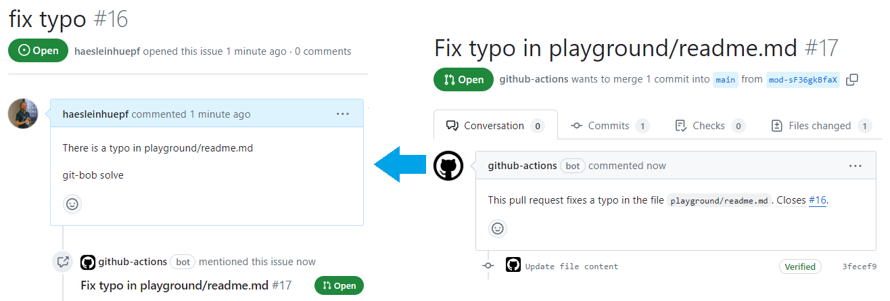
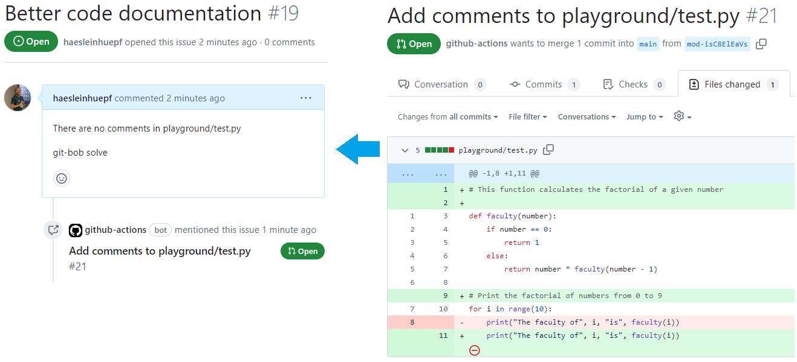
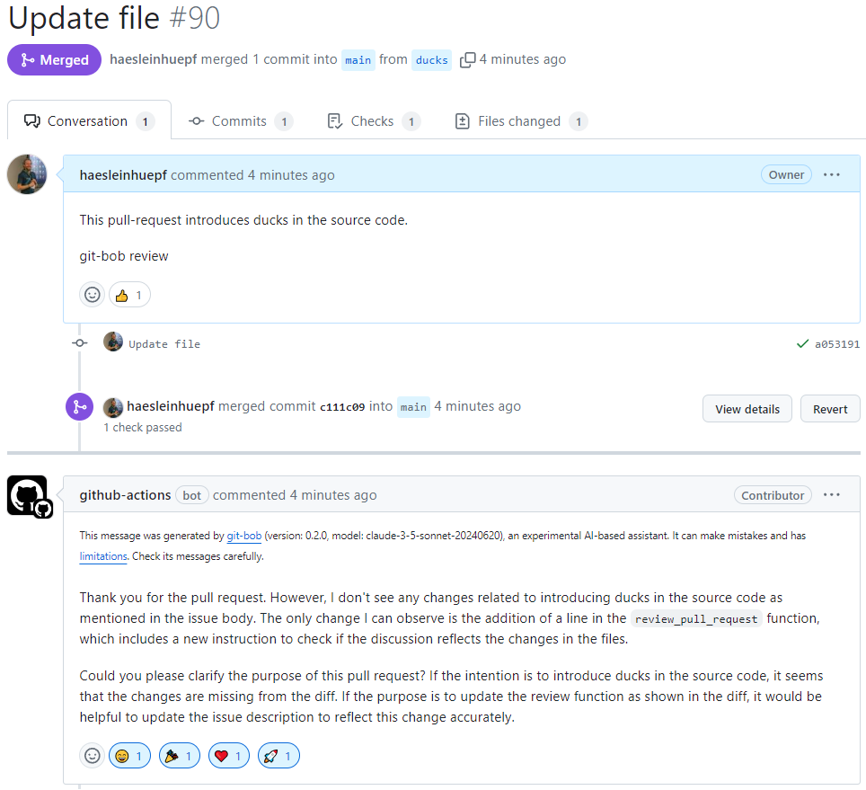
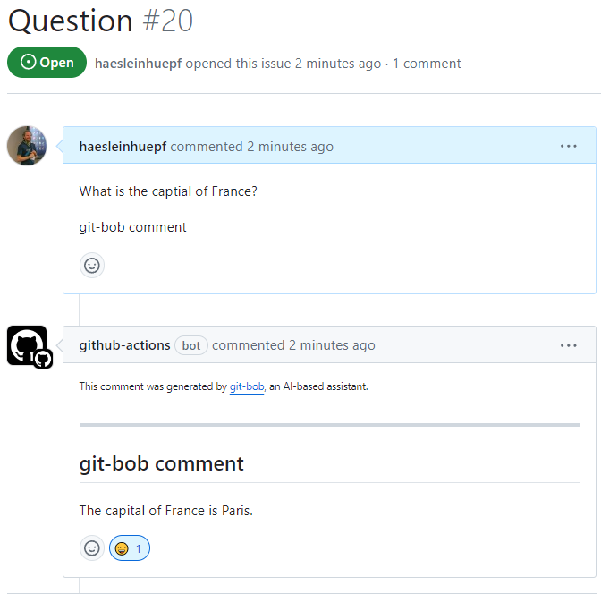

# git-bob

git-bob uses AI to answer github-issues and review pull-requests. 
Under the hood it uses [claude 3.5 sonnet](https://claude.ai) or [gpt-4 omni](https://chat.openai.com/) to understand the text and 
[pygithub](https://github.com/PyGithub/PyGithub) to interact with the issues and pull-requests.


## Disclaimer

`git-bob` is a research project aiming at streamlining github interaction in software development projects. Under the hood it uses
artificial intelligence / large language models to generate text and code fulfilling the user's requests. 
Users are responsible to verify the generated code according to good scientific practice.

When using `git-bob` you configure it to use an API key to access the AI models. 
You have to pay for the usage and must be careful in using the software.
Do not use this technology if you are not aware of the costs and consequences.

> [!CAUTION]
> When using the OpenAI, Google Gemini, Anthropic or any other endpoint via BiA-Bob, you are bound to the terms of service 
> of the respective companies or organizations.
> The prompts you enter are transferred to their servers and may be processed and stored there. 
> Make sure to not submit any sensitive, confidential or personal data. Also using these services may cost money.


## Installation as github action

To use git-bob in your github repository, you need to 
* setup github workflows like shown in [this folder](.github/workflows).
  Make sure to replace `pip install -e .` with a specific git-bob version such as `pip install git-bob==0.1.0`.
* configure a github secret called "ANTHROPIC_API_KEY" or an "OPENAI_API_KEY" and choose which one to use in the github workflow files mentioned above.
* configure github actions to run the workflow on issues and pull-requests. Also give write-access to the action runner.

To trigger git-bob, you need to comment on an issue or pull-request with the following commands:

```
git-bob comment
```

When using openai/gpt-4-omni, you can also use the following command to trigger git-bob.
It will then try to solve the issue and send a pull-request.

```
git-bob solve
```

Note: This will only wor with simple issues that can be solved by modifying a single file.

### Use-case examples

* `git-bob` can fix typos ([issue](https://github.com/haesleinhuepf/git-bob/issues/16), [pull-request](https://github.com/haesleinhuepf/git-bob/pull/17)):



* `git-bob` can improve code documentation ([issue](https://github.com/haesleinhuepf/git-bob/issues/19), [pull-request](https://github.com/haesleinhuepf/git-bob/pull/21)):



* `git-bob` can fix typos ([pull-request](https://github.com/haesleinhuepf/git-bob/pull/11)):



* `git-bob` can also be exploited to answer questions ([issue](https://github.com/haesleinhuepf/git-bob/issues/20)).




## Installation as command-line tool

You can also install git-bob locally and run it from the terminal. 
In this case, create a github token and store it in an environment variable named `GITHUB_API_KEY`. 
Then you can run git-bob like this:

```bash
pip install git-bob
```

## Usage as command-line tool

You can use git-bob from the terminal on repositories you have read/write access to.

```bash
git_bob <action> <organization>/<repository> <issue-number>
```

Available actions:
* `review-pull-request`
* `comment-on-issue`

## Similar projects

There are similar projects out there
* [Claude Engineer](https://github.com/Doriandarko/claude-engineer)
* [BioChatter](https://github.com/biocypher/biochatter)
* [aider](https://github.com/paul-gauthier/aider)
* [OpenDevin](https://github.com/OpenDevin/OpenDevin)
* [Devika](https://github.com/stitionai/devika)
* [GPT-Codemaster](https://github.com/dex3r/GPT-Codemaster)

## Contributing

Feedback and contributions are welcome! Just open an issue and let's discuss before you send a pull-request. 
A [human](https://haesleinhuepf.github.io) will respond and comment on your ideas!


## Acknowledgements

We acknowledge the financial support by the Federal Ministry of Education and Research of Germany and by Sächsische Staatsministerium für Wissenschaft, Kultur und Tourismus in the programme Center of Excellence for AI-research „Center for Scalable Data Analytics and Artificial Intelligence Dresden/Leipzig“, project identification number: ScaDS.AI
